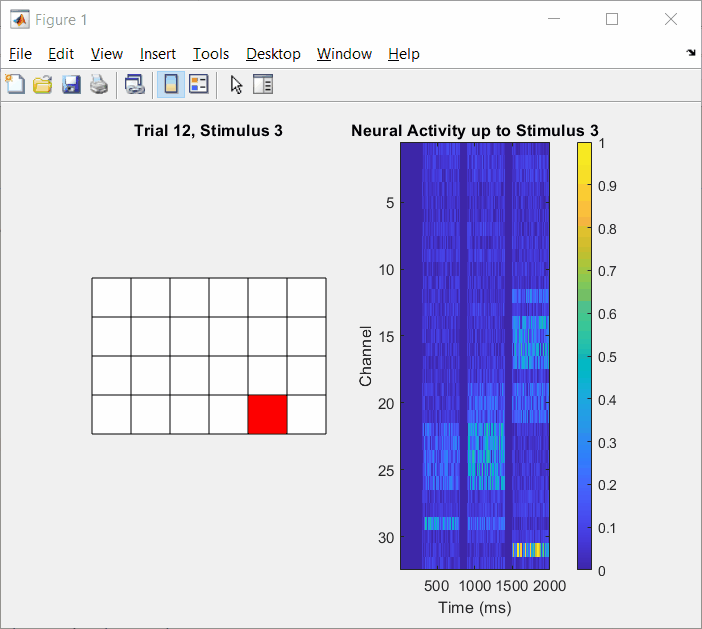

# Population Receptive Field Mapping Animation



This repository contains a small MATLAB simulation for population receptive field (pRF) mapping. It generates a balanced sequence of visual stimulus locations on a grid, simulates multi-channel neural activity across trials, animates the recording process, and reconstructs a spatial receptive field heatmap from the simulated responses.

## What The Project Does

The workflow models an experiment in which:

1. A 2D grid of stimulus locations is defined.
2. Each trial presents 3 unique stimulus locations in sequence.
3. A population of recording channels responds more strongly to stimuli near a shared preferred location.
4. Simulated activity is aggregated across trials to estimate the population receptive field.

The result is a spatial heatmap showing where the simulated neural population is most sensitive.

## Main Entry Point

Run:

```matlab
RF_mapping_simulation
```

The main script will:

1. Configure experiment timing and grid settings.
2. Generate a balanced stimulus schedule.
3. Verify that the schedule is valid.
4. Simulate neural activity for all trials.
5. Animate stimulus presentation and recorded activity.
6. Compute and display the pRF heatmap.
7. Print the ground-truth preferred population location.

## Repository Structure

- `RF_mapping_simulation.m`
  Main script that sets parameters, builds the trial schedule, runs the simulation, and computes the receptive field map.

- `animate_trials.m`
  Simulates each trial and displays a side-by-side animation of the current stimulus and the evolving neural activity matrix.

- `simulate_neural_activity.m`
  Generates channel-by-time activity for a single trial using a Gaussian distance-based response model.

- `calculate_population_receptive_field.m`
  Extracts activity during stimulus windows, averages responses by spatial location, and plots the resulting pRF heatmap.

- `plot_stimulus.m`
  Helper function for drawing the active stimulus location on the grid.

- `prf_ani.gif`
  Example animation preview.

## Default Experiment Setup

The current script is configured for:

- Grid size: `4 x 6`
- Total locations: `24`
- Stimuli per trial: `3`
- Repetitions per location: `10`
- Baseline duration: `300 ms`
- Stimulus duration: `500 ms`
- Inter-stimulus interval: `100 ms`
- Channels: `32`

This produces:

- `80` total trials
- `2000 ms` of recording per trial

## Data Flow

### 1. Trial Schedule Generation

`RF_mapping_simulation.m` creates a matrix named `stimulusLocations` with shape:

```text
totalTrials x 3
```

Each row is one trial, and each entry is a linear index into the stimulus grid. The script verifies:

- The expected total number of trials is generated.
- Each trial contains 3 unique locations.
- Each grid location appears exactly the requested number of times.

### 2. Neural Activity Simulation

For each trial, `simulate_neural_activity.m`:

- Assigns each recording channel a preferred 2D location near a shared peak sensitivity location.
- Adds low-amplitude baseline noise.
- Increases activity during each stimulus window according to the distance between the stimulus location and the channel's preferred location.

The simulated response for one trial has shape:

```text
channels x time
```

The full dataset returned by `animate_trials.m` has shape:

```text
trials x channels x time
```

### 3. Population Receptive Field Estimation

`calculate_population_receptive_field.m`:

- Finds the time windows corresponding to each of the 3 stimulus presentations.
- Collects all neural activity segments associated with each grid location.
- Averages responses across time, channels, and repetitions.
- Places the mean response back into the corresponding row and column of the grid.

The final visualization is shown as either:

- a discrete heatmap, or
- an interpolated smoothed map

depending on the `interpolation` flag in the main script.

## Requirements

- MATLAB
- Statistics and Machine Learning Toolbox
  Needed for the `heatmap` visualization path

## Notes And Current Constraints

- The main script exposes `arraySize` as a parameter, but `simulate_neural_activity.m` currently hardcodes the grid as `4 x 6`. In practice, the project should presently be treated as a `4 x 6` simulation unless that helper function is updated.
- The code is a compact educational simulation meant to illustrate stimulus scheduling, neural response generation, and receptive field recovery rather than serve as a full biological model.
- The animation and the pRF heatmap are both generated directly from the simulated dataset during execution.

## Customization

The easiest parameters to change are at the top of `RF_mapping_simulation.m`:

- `arraySize`
- `repetitionsPerLocation`
- `baselineDuration`
- `stimulusDuration`
- `ISIDuration`
- `numChannels`
- `color_map`
- `interpolation`

If you want to generalize the simulation beyond a `4 x 6` grid, update `simulate_neural_activity.m` so its internal grid dimensions come from `arraySize` rather than fixed values.

## Expected Output

Running the script should produce:

- Console messages validating the trial schedule
- An animated figure showing:
  - the active stimulus location
  - the simulated neural activity matrix
- A population receptive field heatmap
- A printed preferred location such as:

```text
Population's preferred location: row = X; column = Y.
```

## License

This project is distributed under the terms of the [LICENSE](LICENSE) file.
